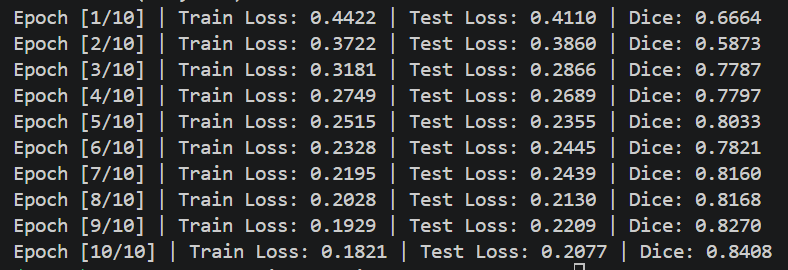

# Convolutional Neural Network

Based on Deep Learning Specialization, deeplearning.ai, this repository keeps track of my trial on ResNet

## 1. ResNet 18
- Using PyTorch, I've implemented basic Residual Block with two 3x3 convolution layer with ReLU activation function, a shortcut path and 1x1 convolution to match the dimension of images
- With that, I've made ResNet-18 with 4 residual layers, each stacked with two Res Block, average pooling layer and fully connected layer in the end
- For better performance, I've also implemented mini - batch gradient descent with Adam Optimization. (Batch Normalization is NOT yet implemented)

## 2. MobileNet V2 
- Based on CIFAR-10 dataset, I've made Initial 3x3 convolution, stacked bottleneck blocks, final 1x1 convolution with average pooling and FC in the end.
- I've set 7 layers of bottleneck layers (total of 17 bottleneck blocks), each layer's parameters designated with [t,c,n,s]
- More to do: Calculate the stride, padding needed for each step to match the needed dimensions.

## 3. YOLO Algorithm

## 4. U-Net Implementation
- Based on Oxford IIIT Pet Segmentation, I've implemented U Net Algorithm to mask the original image to 0: background, boundary or 1: pet
- I've implemented basic convolution block with two 3x3 convolution each with ReLU
- I've constructed Encoder by connecting 4 basic convolution and 1 bottleneck, all connected by Max Pooling
- I've constructed Decoder using Transposed Convolution and concatenating the corresponding encoder feature (shortcut)
- With final 1x1 convolution, I've produced single channel binary segmentation
- Using CUDA (RTX 3070) I've done 10 epochs:

